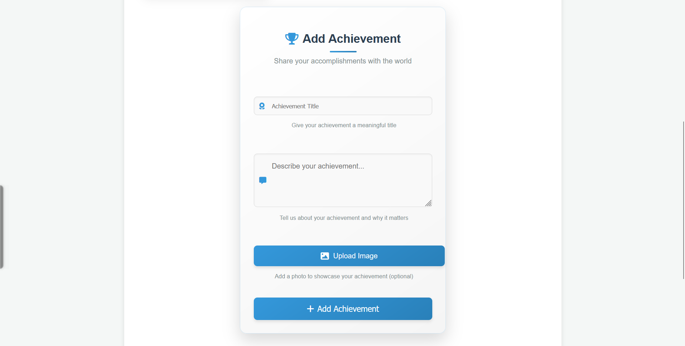

# Achievement Adder

A responsive web application that allows users to create an account, log in, and manage their achievements. Users can add, edit, and delete their achievements with images and descriptions.

## Preview

## Live Demo

[View Live Demo](https://achievement-adder-sainath.netlify.app/)

## Features

- Responsive design that works on all devices
- User authentication (login/register)
- Persistent login state using localStorage
- Add achievements with title, description, and image
- Edit and delete your own achievements
- Sort achievements by newest first
- Responsive form layout
- Modern UI with animations and transitions
- Accessibility features for screen readers

## Technologies Used

- HTML5
- CSS3 (Responsive Design, Flexbox, Grid, Animations)
- JavaScript (ES6+)
- LocalStorage for data persistence
- Font Awesome for icons

## How to Use

1. Register a new account or log in with existing credentials
2. Add your achievements using the form
3. View all your achievements in the gallery
4. Edit or delete your achievements as needed
5. Log out when finished

## Installation

1. Clone this repository
2. Open `index.html` in your browser

## Future Improvements

- Add password hashing for better security
- Implement image compression for better performance
- Add categories for achievements
- Add search and filter functionality

  
Made with ❤️ by Your Sainathreddy

  

    <a href="https://github.com/sainath-666">GitHub</a> |
    <a href="https://www.linkedin.com/in/sainath666">LinkedIn</a>
  

